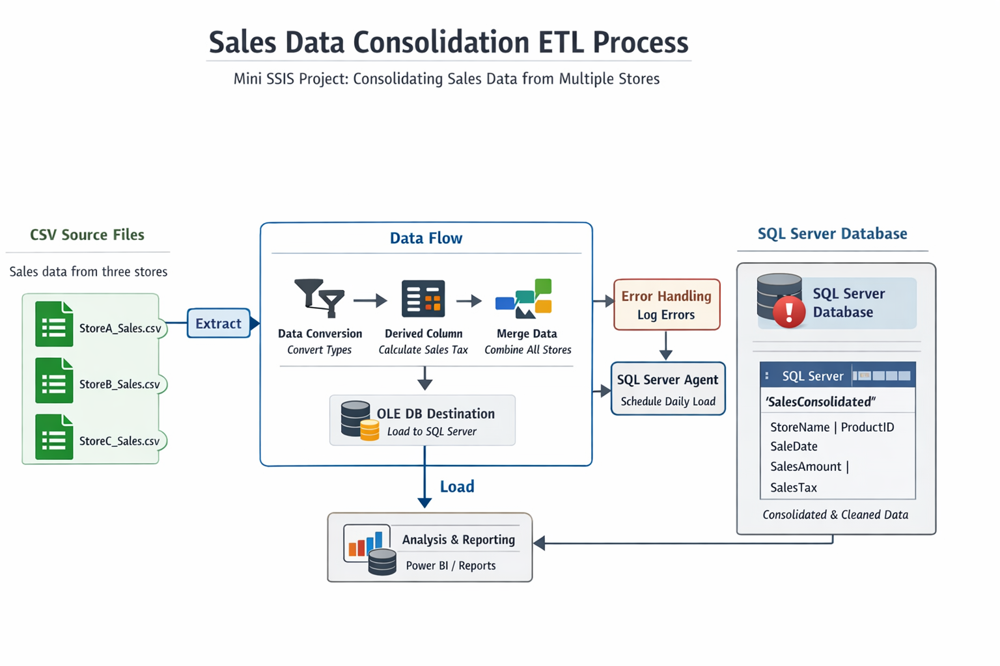

# SSIS Sales Data Consolidation (Mini Project)

## Overview

This mini project demonstrates an **end-to-end ETL pipeline** built using  
**SQL Server Integration Services (SSIS)**.

The objective is to consolidate sales data from multiple flat file sources
(CSV files representing different stores) into a **single SQL Server table**
ready for analytics and reporting.

This project is designed to simulate a **real-world data engineering workflow**
using enterprise tooling.

---

## Problem Statement

Sales data is generated daily by multiple stores and delivered as separate CSV files.
The data must be:

- Ingested from multiple sources
- Cleaned and standardized
- Enriched with calculated fields
- Loaded into a centralized relational database

The solution should be repeatable, scalable, and include basic error handling.

---

## Architecture & Data Flow

The diagram below illustrates the SSIS ETL pipeline implemented in this project:

---

## Data Sources

Three flat files represent sales data from different stores:

- `StoreA_Sales.csv`
- `StoreB_Sales.csv`
- `StoreC_Sales.csv`

Each file contains:
- ProductID
- ProductName
- SaleDate
- Quantity
- SalesAmount

---

## Transformations Applied

The following transformations are implemented in the SSIS Data Flow:

- **Data Conversion**
  - Ensures numeric and date fields match SQL Server data types

- **Derived Column**
  - Calculates `SalesTax` as 15% of `SalesAmount`

- **Data Consolidation**
  - Merges data from all store files into a unified dataset

- **Error Handling**
  - Failed rows are redirected and logged for troubleshooting

---

## Destination

All cleaned and transformed data is loaded into a SQL Server table:

**Table:** `SalesConsolidated`

Key columns:
- StoreName
- ProductID
- ProductName
- SaleDate
- Quantity
- SalesAmount
- SalesTax

The resulting table is suitable for:
- BI tools (e.g., Power BI)
- Reporting
- Further analytical processing

---

## Technologies Used

- SQL Server
- SQL Server Integration Services (SSIS)
- Visual Studio (SSDT)
- Flat Files (CSV)
- SQL

---

## How This Project Is Used

This project exists to demonstrate:

- Practical ETL design using SSIS
- Data engineering fundamentals beyond querying
- Understanding of production-style data pipelines
- Clear documentation and architecture explanation

Although built as a self-practice project, the structure and logic mirror
real enterprise ETL workflows.

---

## Possible Extensions

Future improvements could include:

- Parameterized file paths
- Incremental loading logic
- Slowly Changing Dimensions (SCD)
- Scheduling via SQL Server Agent
- Integration with Power BI dashboards
